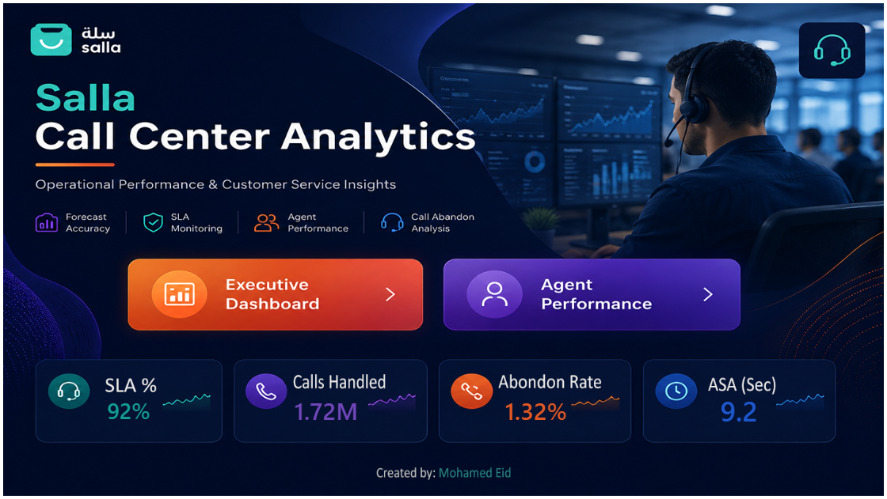
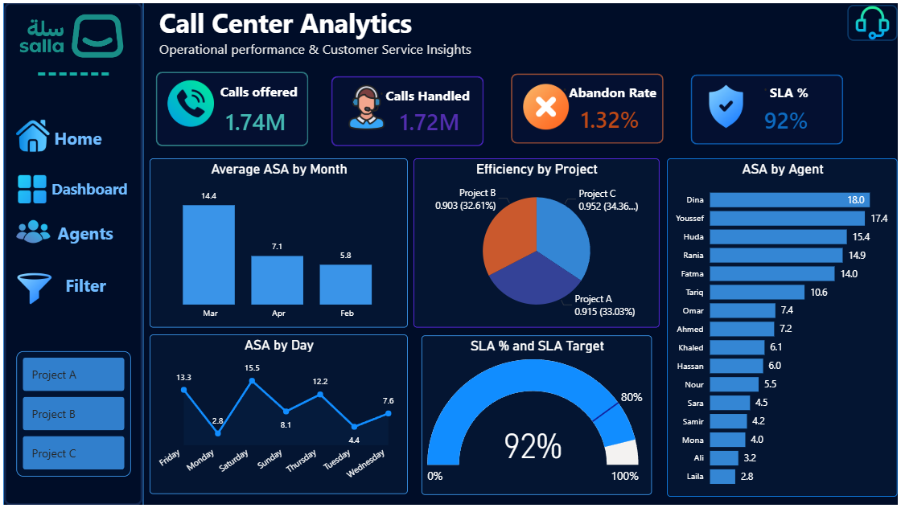
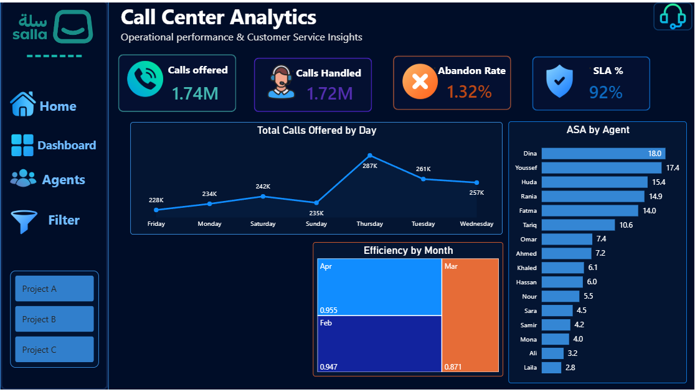

# 📊 Call Center Performance Dashboard

## 📌 Project Overview

This project focuses on analyzing call center operational performance using Power BI and Excel.

The dashboard was designed to monitor KPIs, evaluate agent and service performance, and provide actionable operational insights for better decision-making.

Demo_Link: https://app.powerbi.com/groups/me/reports/35036538-82bf-4205-a5c9-85cf264cd18f?ctid=77255288-5298-4ea5-81aa-a13e604c30ac&pbi_source=linkShare&bookmarkGuid=f9c1d713-3751-4f5f-9025-58c8d8547e5f

---

# 🎯 Business Objectives

- Monitor overall call center performance
- Track SLA compliance and operational efficiency
- Analyze abandoned calls and handling performance
- Improve customer service responsiveness
- Support data-driven operational decisions

---

# 🛠 Tools & Technologies

- Power BI
- Excel
- Power Query
- DAX
- Data Modeling

---

# 🧹 Data Preparation & Transformation

The raw data was cleaned and transformed using Power Query.

### Data preparation steps included:

- Removing duplicates
- Handling missing/null values
- Formatting date and time fields
- Standardizing column names
- Cleaning inconsistent values
- Creating calculated columns where necessary

---

# 🗂 Data Modeling

A structured data model was built to optimize dashboard performance and analysis.

### Modeling work included:

- Building relationships between tables
- Creating a dedicated Date Table
- Organizing measures into a separate measures table
- Applying star-schema concepts where applicable

---

# 📐 DAX Measures Created

Custom DAX measures were developed to calculate and monitor key operational KPIs.

### KPIs included:

- Abandoned Rate
- Answer Rate
- SLA
- SLA Target
- Efficiency
- ETA
- Handle Ratio
- Total Calls Offered
- Total Calls Handled
- Total Abandoned Calls

---

# 📊 Dashboard Features

The dashboard was designed with a professional and interactive UI focused on usability and operational monitoring.

### Features included:

- Interactive slicers and filters
- KPI cards
- Trend analysis charts
- Quick charts for performance tracking
- Dynamic filtering
- Responsive dashboard layout
- Professional color palette and visual consistency

---

# 📈 Key Insights Generated

The dashboard helps identify:

- Peak call volume periods
- SLA performance trends
- Call abandonment behavior
- Operational bottlenecks
- Efficiency fluctuations
- Overall service quality performance

---

# 💡 Business Value

This dashboard enables management teams to:

- Improve operational efficiency
- Reduce abandoned calls
- Monitor agent performance
- Maintain SLA targets
- Make faster data-driven decisions

---

# 📁 Project Structure

```bash
call-center-dashboard/

│
├── data/
├── powerbi/
├── images/
├── docs/
└── README.md
```

---

# 📸 Dashboard Preview





---

# 🚀 Future Improvements

Potential future enhancements:

- Real-time data integration
- Agent-level performance tracking
- Forecasting and predictive analytics
- Automated reporting


# 👨‍💻 Created By

### Mohamed Eid

LinkedIn:
https://www.linkedin.com/in/mohamedeid25
